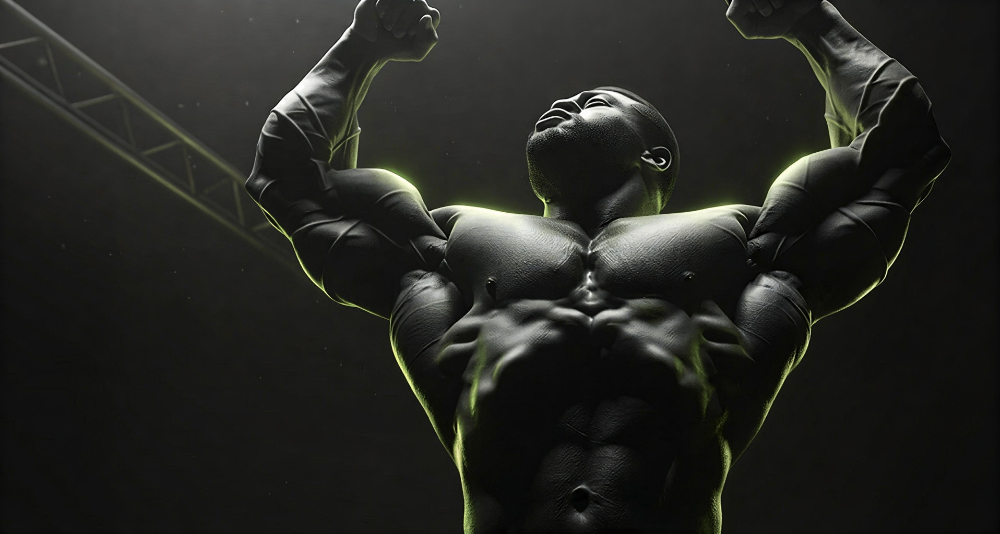
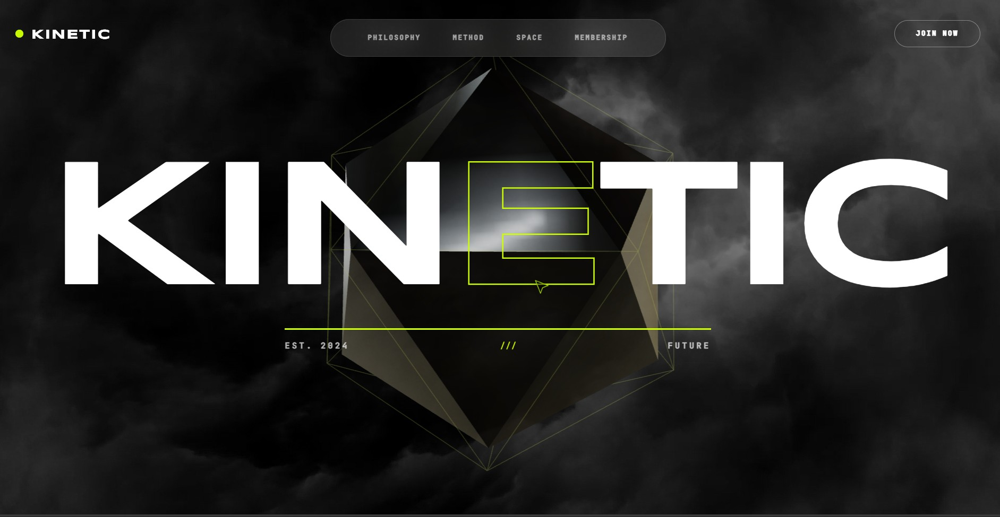

# KINETIC || THE ANTI-GYM




<div align="center">

[](https://your-project-name.vercel.app)
[](https://nextjs.org/)
[](https://www.typescriptlang.org/)
[](https://tailwindcss.com/)

[**🚀 VIEW LIVE DEPLOYMENT**](https://your-project-name.vercel.app)

</div>

---

## ⚡ System Overview

**KINETIC** is a brutalist, high-performance web interface designed for a luxury athletic facility. The site embodies the concept of "biological optimization" through a strict design system of raw data, neon accents (`#CCFF00`), and industrial typography.

Unlike standard landing pages, KINETIC treats the DOM as a HUD (Heads-Up Display), utilizing physics-based interactions and zero-latency animations to create an immersive "Tactical OS" feel.

## 🛠️ Tech Stack & Architecture

* **Core:** Next.js 14 (App Router), React, TypeScript.
* **Styling:** Tailwind CSS, Custom Utility Classes.
* **Animation Engine:**
    * **GSAP (ScrollTrigger):** For complex timeline-based scroll effects (Horizontal Scroll, Parallax).
    * **Framer Motion:** For spring physics, micro-interactions, and magnetic elements.
    * **Lenis:** For normalized, luxury-grade smooth scrolling.
* **Performance:**
    * CSS-based static noise (replacing heavy SVG turbulence filters).
    * `will-change` optimization for GPU layering.
    * Dynamic imports and component lazy loading.

## 🌟 Key Features

### 1. The "Tactical" Cursor
A custom SVG pointer that replaces the default OS cursor.
* **Velocity Tilt:** The cursor leans into the direction of movement based on mouse velocity (clamped to +/- 12 degrees).
* **Aerogel Visor:** Features a semi-transparent, frosted interior using CSS clipping and backdrop filters.
* **State Awareness:** Reacts to text, interactive elements, and magnetic fields.

### 2. "Aerogel" Navigation System
* **Desktop:** A floating glass-morphism dock with "Scramble Text" decryption effects on hover.
* **Mobile:** A slide-out "Cyber-Latch" menu with heavy blur, spring-loaded animations, and sound-reactive visuals.

### 3. Magnetic Liquid UI
The "JOIN NOW" CTA features a custom magnetic physics engine.
* **Liquid Fill:** The button fill tracks the cursor position *inside* the element boundaries.
* **Border Sync:** The border moves in perfect unison with the fill, creating a cohesive physical object.

### 4. Hybrid Hero Section
* **Desktop:** Renders a high-bitrate video background with a 3D "Artifact" overlay.
* **Mobile:** Automatically swaps to a static, high-performance image with "System Boot" overlays to save battery and data.

## 🚀 Getting Started

1.  **Clone the repository:**
    ```bash
    git clone [https://github.com/KalashMaheshwari/kinetic-gym.git](https://github.com/KalashMaheshwari/kinetic-gym.git)
    cd kinetic-gym
    ```

2.  **Install dependencies:**
    ```bash
    npm install
    # or
    pnpm install
    ```

3.  **Run the development server:**
    ```bash
    npm run dev
    ```

4.  **Build for production:**
    ```bash
    npm run build
    ```

## 📂 Project Structure

```bash
├── app/
│   ├── globals.css        # Global styles & Lenis CSS
│   ├── layout.tsx         # Root layout (Fonts, Navbar, Cursor)
│   └── page.tsx           # Main Single Page Application
├── components/
│   ├── home/              # Section-specific views (Philosophy, Method, etc.)
│   ├── layout/            # Navbar, Footer
│   └── ui/                # Reusable atoms (Cursor, Magnetic Buttons)
└── public/                # Static assets
